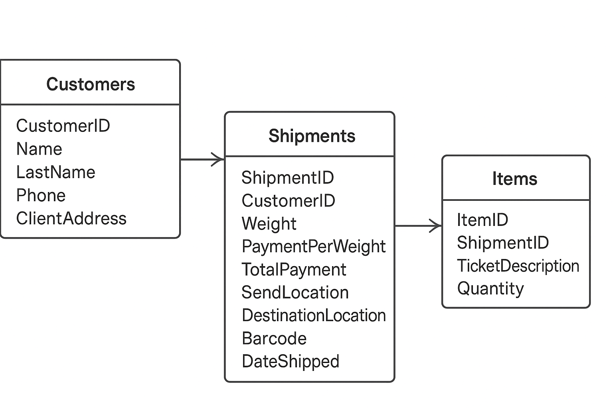
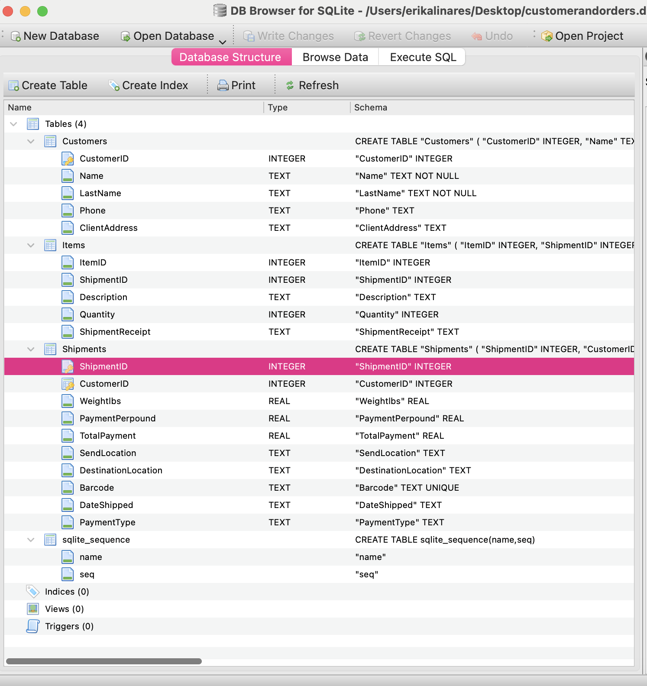

# Database SQLITE
****

## Project:

Create a database using SQLite to manage customer shipments with organized tables.

Task:
	•	Organize and clean data for efficient storage
	•	Split data into clear, logical tables for easy management
	•	Build schema to define table structures and relationships

Schema Overview:

The database consists of three main tables:
	•	Customers — stores customer details (ID, name, contact info)
	•	Shipments — records shipment details linked to customers (weight, payment, locations, barcode)
	•	Items — lists items included in each shipment with descriptions and quantities

Each table is connected via unique IDs to maintain relationships between customers, shipments, and items, ensuring data integrity and easy querying.

Schema Design 

SQLITE:Database Tables 

Purpose:
To streamline the tracking and management of shipments, improve data accuracy, and support easy retrieval of customer and package information.

Note: The database allows modifications to the Customer table, such as adding shipment receipt information (guía) related to items or shipments for better tracking.
